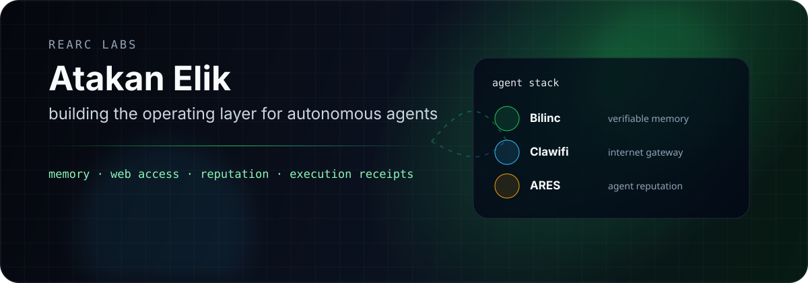

<div align="center">
  
</div>

<br />

<div align="center">

[](https://rearclabs.com)
[](https://www.python.org/)
[](https://www.typescriptlang.org/)
[](https://modelcontextprotocol.io/)

</div>

## Building the operating layer for autonomous agents

I'm Atakan Elik, founder of **ReARC Labs**. I build infrastructure for agents that need to remember, browse, verify, and act with accountability.

The thesis is simple: capable agents need more than model calls. They need durable state, source-grounded internet access, verifiable execution records, and trust surfaces that humans can inspect.

<table>
<tr>
<td width="33%" valign="top">

### Bilinc

Verifiable agent memory and state.

- recall, claims, contradictions
- provenance-aware memory
- local-first agent brain

</td>
<td width="33%" valign="top">

### Clawifi

Internet gateway for AI agents.

- search, fetch, browser sessions
- structured extraction
- OSINT and MCP tools

[Public repo →](https://github.com/atakanelik34/clawifi)

</td>
<td width="33%" valign="top">

### ARES Protocol

Reputation and accountability for autonomous agents.

- AgentID and operator binding
- signed scorecards
- execution receipts

</td>
</tr>
</table>

## Current focus

```txt
memory layer      Bilinc      durable agent state, recall, claims, provenance
web layer         Clawifi     search, browser, extraction, OSINT, MCP
trust layer       ARES        reputation, scorecards, execution accountability
product layer     Docly       document intelligence and workflow automation
company layer     Compaly     AI-native company operations
```

## Stack I keep close

<p>
  
  
  
  
  
  
  
  
</p>

## Selected public work

<a href="https://github.com/atakanelik34/clawifi">
  
</a>

<br />
<br />

<div align="center">
  
</div>

---

<div align="center">
  <sub>Agents should leave receipts. Systems should stay inspectable.</sub>
</div>
