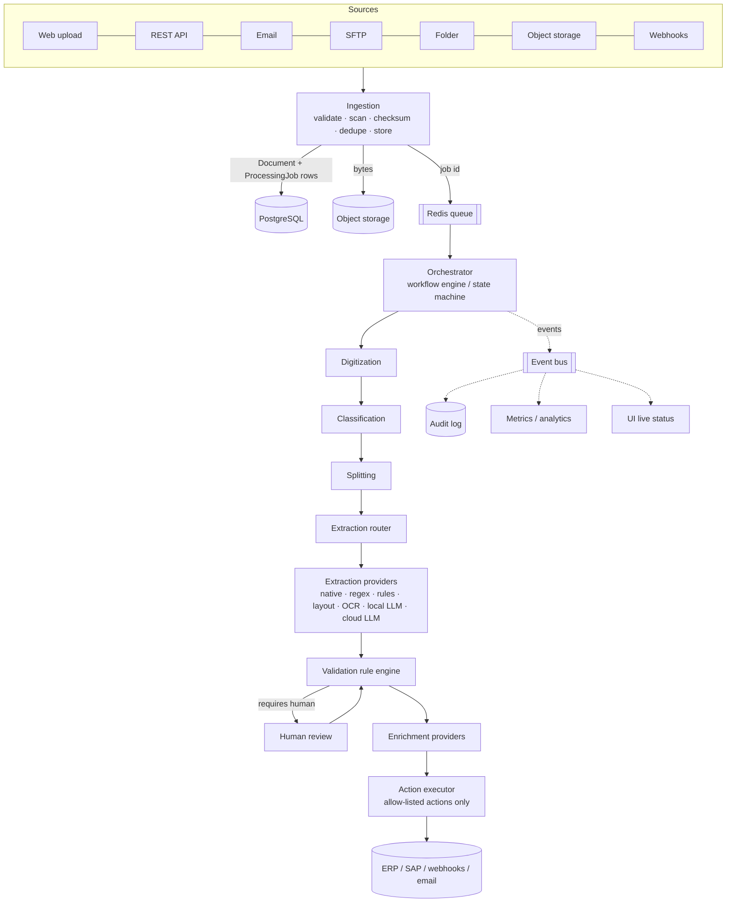
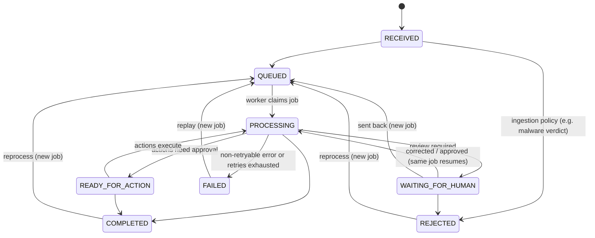

# IDP Platform — Architecture

> Status: see the roadmap table in §16 (each phase is marked when implemented) and the decision log in §17.
> This document is the source of truth for structure and contracts. When code
> and this document disagree, fix one of them in the same change.

---

## 0. Guiding decisions

| # | Decision | Why |
|---|----------|-----|
| D1 | **Deterministic where possible, AI-assisted where useful, human-controlled where necessary.** | Validation, permissions, money math, DB writes and external actions must be reproducible and auditable. AI is used for classification, routing hints, semantic extraction and ambiguous interpretation only. |
| D2 | **Every processing capability sits behind a port (Protocol) with adapters.** | No single OCR engine, LLM, storage, or extraction technique is load-bearing. The orchestrator only knows ports. |
| D3 | **Postgres is the system of record; the queue only carries IDs.** | Jobs survive Redis loss, workers are idempotent (they reload state from Postgres), and every transition is auditable. |
| D4 | **Binary documents live in object storage, never in Postgres.** | Size, cost, backups, signed URLs. |
| D5 | **Local-first data policy, enforced in code.** | A `ProcessingPolicy` decides whether any byte may leave the environment. Providers declare their locality; the router *and* the provider gateway both enforce it (defense in depth). |
| D6 | **Configuration is versioned and immutable once used.** | Schemas, workflows, routing policies and provider configs are versioned; every run pins the versions it used, so historical runs stay reproducible. |
| D7 | **Human review is a lifecycle state, not an error.** | `WAITING_FOR_HUMAN` is a normal path; intervention is tracked as a metric, not a failure. |
| D8 | **No fake AI.** | Unconfigured providers report `not_configured`. Development uses explicitly named `Mock*` providers that are visibly labelled as mocks in API and UI. |
| D9 | **Modular monolith first, service boundaries later.** | One backend codebase with strict layering, two process types (API, worker). Boundaries are drawn so modules can be extracted if throughput ever demands it. |

### Reference image

`docs/reference/ocr.jpg` shows the conceptual "Agentic OCR" flow:
channels (Portal / Email / SFTP-API) → Orchestrator/Manager agent → Extraction
agent → {Text, Layout, OCR} paths → Validation agent → Enrichment agent
(QuickBooks / Dynamics / SAP) → System Action agent.

We keep that shape and extend it into a product architecture. Differences:

* Ingestion is its own stage (security checks, dedupe, normalisation) before
  the orchestrator ever sees a document.
* Digitization, classification and **splitting** are explicit stages before
  extraction (the image folds them into "Extraction Agent").
* The Text/Layout/OCR "paths" become a **routing engine** over pluggable
  `DigitizationProvider`s and `ExtractionProvider`s with a recorded route trace.
* **Human review** is a first-class stage (absent from the image).
* The "agents" are bounded components with explicit ports, not free-roaming
  LLM loops. Only the System Action stage touches external systems, and only
  through configured, authorised actions.
* Audit/analytics is a cross-cutting sink for every stage.

---

## 1. System architecture



### Runtime processes

```
browser ──► frontend (static SPA, nginx) ──► api (FastAPI) ──► PostgreSQL
                                               │    │
                                               │    └──► object storage (MinIO / S3 / local fs)
                                               └──► Redis ──► worker(s) (arq) ──► pipeline
```

* **api** — HTTP only. Never runs pipeline stages inline. Validates, authorises,
  persists, enqueues.
* **worker** — horizontally scalable. Pulls job IDs, loads state from Postgres,
  executes workflow steps, persists results, emits events. Concurrency is set
  per worker (`WORKER_MAX_JOBS`).
* **frontend** — static SPA. Holds no secrets; talks only to `/api`.

### Layering (backend)

```
api            → FastAPI routers, request/response DTOs, auth dependencies
application    → use cases / services; orchestrates domain + ports; owns transactions
domain         → entities, value objects, state machine, rules, errors. Pure Python, no I/O
infrastructure → SQLAlchemy, Redis, S3, JWT, hashing, logging — adapters for ports
providers      → processing adapters (digitization, extraction, LLM, enrichment, actions)
workers        → queue entrypoints that call application services
```

Allowed import direction: `api → application → domain`, `infrastructure → domain`,
`application → infrastructure`. `domain` imports nothing from the other layers.
A port (Protocol) is introduced where substitution is real — storage, queue,
every processing provider — not around every repository: application services
use the SQLAlchemy repositories and security helpers directly. This keeps the
code honest about what is pluggable.
Wiring (choosing adapters) happens only in composition roots: `idp.main`,
`idp.workers.main`, and `idp.api.deps`.

---

## 2. Directory structure

```
idp/
├── ARCHITECTURE.md · CLAUDE.md · README.md
├── docker-compose.yml          # postgres, redis, minio, migrate, api, worker, frontend (+ollama profile)
├── .env.example
├── Makefile
├── docs/reference/ocr.jpg
├── backend/
│   ├── pyproject.toml          # deps, ruff, mypy, pytest config
│   ├── Dockerfile
│   ├── alembic.ini
│   ├── migrations/             # Alembic env + versioned migrations (the only way schema changes)
│   ├── src/idp/
│   │   ├── main.py             # API composition root (app factory)
│   │   ├── config.py           # typed settings from env (development/test/production)
│   │   ├── cli.py              # operational commands (bootstrap tenant/admin)
│   │   ├── api/
│   │   │   ├── deps.py         # DI: sessions, current principal, permission guards
│   │   │   ├── errors.py       # error-category → HTTP mapping, problem+json
│   │   │   ├── middleware.py   # correlation id, access log, security headers
│   │   │   ├── schemas/        # API DTOs (never ORM objects)
│   │   │   └── routes/         # health, auth, users, tenants, … (one module per resource)
│   │   ├── application/        # services: auth, users, audit, health, (ingestion, review, …)
│   │   ├── domain/             # errors, identity/RBAC, lifecycle state machine, (taxonomy, fields, rules, …)
│   │   ├── infrastructure/
│   │   │   ├── db/             # engine/session, ORM models, repositories
│   │   │   ├── storage/        # ObjectStorageProvider port + s3/local adapters
│   │   │   ├── queue/          # job queue port + arq/redis adapter
│   │   │   ├── security/       # password hashing, JWT
│   │   │   └── logging.py      # structured JSON logs, redaction
│   │   ├── providers/          # (phase 3+) digitization, ocr, classification, extraction, llm, enrichment, actions
│   │   └── workers/            # arq WorkerSettings + task entrypoints
│   └── tests/                  # unit/ (no I/O) · integration/ (postgres, redis, storage) · api/
└── frontend/
    ├── package.json · vite.config.ts · tsconfig*.json · eslint.config.js
    ├── Dockerfile · nginx.conf
    └── src/
        ├── app/                # router, providers (query client, auth)
        ├── components/ui/      # shadcn-style primitives (button, card, badge, input, …)
        ├── components/layout/  # app shell, sidebar, top bar
        ├── features/           # one folder per product area (auth, dashboard, system, documents, review, …)
        └── lib/                # api client, formatting, utils
```

---

## 3. Domain model

### 3.1 Identity & tenancy

```
Tenant 1─* Project
Tenant 1─* User            (User.role ∈ {owner, admin, operator, reviewer, viewer})
Tenant 1─* ApiKey          (phase 2; machine ingestion)
* Every tenant-owned row has tenant_id (FK, indexed). Every query is tenant-scoped
  by the repository layer; the API never accepts tenant_id from the client body.
```

### 3.2 Documents

```
Document                     the physical file as received
  id, tenant_id, project_id, source(channel), source_ref,
  original_filename (display only, never used as a path),
  detected_mime_type, declared_mime_type, size_bytes, sha256,
  storage_key (opaque), status (DocumentStatus), received_at,
  metadata (jsonb), deleted_at
  UNIQUE (tenant_id, project_id, sha256) WHERE deleted_at IS NULL   → duplicate guard

DocumentPage                 one row per page (probe in phase 2; digitization fills the rest)
  document_id, page_number, width, height, unit, rotation,
  has_text_layer, char_count,                                  ← phase 2
  text_layer: native|ocr|hybrid|none, text_quality (0..1),     ← phase 3
  language, ocr_confidence, layout_ref (storage key of the geometry JSON)

DocumentPart                 a logical document inside a file (splitting result)
  document_id, page_start, page_end, document_type_id, schema_version_id,
  classification_confidence, classifier, status
  (single-document file ⇒ exactly one part spanning all pages)
```

Geometry (words → lines → blocks with bounding boxes, per page) is large and
read-mostly; it is stored as a JSON blob in object storage and referenced from
`document_pages.layout_ref`. Postgres keeps the searchable summary.

Bounding boxes are **normalised** `[x0, y0, x1, y1]` in `0..1` relative to the
page, origin top-left, so the viewer can draw them at any zoom/rotation.

### 3.3 Taxonomy & schemas (configurable, versioned)

```
DocumentType      tenant_id, project_id?, key ("invoice"), name, description, is_active
SchemaVersion     document_type_id, version (int), status: draft|published|retired,
                  definition (jsonb, the FieldDefinition tree), published_at
                  — published versions are immutable; edits create a new draft.
FieldDefinition   (inside SchemaVersion.definition)
  { name, type, required, description, aliases[], extraction_hints[],
    validation_rules[], confidence_threshold, normalization_rules[],
    children[] (for object), item (for array) }
FieldType         string|integer|decimal|currency|date|datetime|boolean|email|phone|
                  address|iban|tax_number|array|object
```

`invoice.lines[]` is `array` whose `item` is an `object` field with
`description, quantity, unit_price, tax_rate, total`.

A `fields` table mirrors the published definition (flattened paths like
`lines[].total`) for indexing/analytics; the JSON definition is canonical.

### 3.4 Processing

```
ProcessingJob     one execution of a workflow on a document (= the "workflow run").
                  document_id, workflow_key, workflow_version, pipeline_version, trigger,
                  status (JobStatus), attempts, max_attempts, next_attempt_at,
                  lease_expires_at, current_step, last_error_{category,code,message},
                  correlation_id, requested_by_id, started_at, finished_at
                  UNIQUE (document_id) WHERE status IN active set  → one active job per document
                  (A separate workflow_runs table was dropped: job and run were 1:1.)
ProcessingStep    job_id, step_key (probe|digitize|classify|split|extract|validate|enrich|review|action),
                  status, attempt, provider, model, provider_version,
                  started_at, duration_ms, route_trace (jsonb), metrics (jsonb),
                  error_category, error_message
ExtractionResult  part_id, job_id, schema_version_id, provider, model, route, cost_estimate
ExtractedField    result_id, path, row_id?, value (jsonb), normalized_value,
                  confidence, provenance (jsonb), status: extracted|corrected|rejected
                  Repeating groups use STABLE ROW IDS, not array indexes:
                  path "lines[].total" + row_id "r_7f3a". Inserting/deleting a line
                  during review must not re-point corrections, provenance or ground truth.
ValidationResult  part_id, job_id, rule_id, field_path?, outcome: PASS|WARNING|FAIL|REQUIRES_HUMAN, message
ReviewTask        part_id, reason[], status: open|in_progress|approved|rejected|sent_back,
                  assignee_id, due_at
ReviewAction      task_id, actor_id, action: accept|edit|reject|approve|send_back,
                  field_path?, original_value, corrected_value, reason, at
                  — doubles as the feedback dataset for evaluation/fine-tuning
EnrichmentResult  part_id, job_id, provider, lookup_key, result (jsonb), matched, confidence
ActionRun         part_id, job_id, action_key, status, idempotency_key UNIQUE, request_ref,
                  response_ref, error
```

### 3.5 Provenance (attached to every `ExtractedField`)

```json
{
  "method": "ocr+llm",
  "provider": "local-llm", "model": "qwen2.5:7b", "provider_version": "1.0.0",
  "page": 1,
  "bbox": [0.62, 0.08, 0.91, 0.11],
  "source_text": "INV-2026-00123",
  "extracted_at": "2026-10-03T12:00:00Z",
  "pipeline_version": "2026.10.0",
  "schema_version_id": "…", "route": "LAYOUT_EXTRACTION"
}
```

### 3.6 Configuration & governance

```
WorkflowDefinition / WorkflowVersion   versioned step graph (jsonb), immutable once published
ProviderConfig / ProviderConfigVersion provider key, kind, locality, settings (secrets by env reference only)
ModelRegistry                          provider, model id, version, cost per 1k tokens/page, locality
ProcessingPolicy                       per tenant (+ project override):
                                       data_residency: LOCAL_ONLY|HYBRID|CLOUD_ALLOWED,
                                       allow_cloud_llm, allow_cloud_ocr, preferred_extraction
AuditLog                               tenant_id, actor_type, actor_id, action, entity_type, entity_id,
                                       before (jsonb), after (jsonb), correlation_id, ip, at
```

---

## 4. Processing lifecycle (state machine)

Implemented in `backend/src/idp/domain/lifecycle.py` (pure, unit tested).
Every transition goes through `lifecycle.transition()`, which rejects
illegal moves and returns a `StatusTransition` record that the application
layer persists into `audit_logs`.

The document status is **coarse and independent of workflow steps**. Which
steps exist (probe, digitize, classify, …) is a property of the workflow
version; step progress lives on `processing_jobs` / `processing_steps`. This
keeps configurable workflows from ever needing a new document status.



Job status (`JobStatus`): `QUEUED → RUNNING → SUCCEEDED`, with
`RUNNING → RETRY_SCHEDULED → RUNNING` for retryable errors,
`RUNNING → FAILED` for non-retryable errors (e.g. corrupted file) and
`RUNNING → DEAD_LETTERED` when retries are exhausted. While a job retries, the
document stays `PROCESSING`. Step status: `RUNNING | SUCCEEDED | FAILED`.

* Every document status change is written with an audit entry
  (`document.status_changed`, before/after) in the same transaction.
* For multi-part files (phase 4) the document status is derived from its parts:
  `COMPLETED` only when every part is; any part waiting for review ⇒ `WAITING_FOR_HUMAN`.
* Human review is tracked via `review_tasks`; `human_intervention_rate` is a metric.

---

## 5. Provider interfaces (ports)

All ports are `typing.Protocol`s in the module that owns them. Every provider
exposes a `descriptor` so the router and UI can reason about it without
instantiating vendor SDKs.

```python
class Locality(StrEnum): LOCAL = "local"; CLOUD = "cloud"

@dataclass(frozen=True)
class ProviderDescriptor:
    key: str                  # "native-pdf", "tesseract", "ollama", "mock-ocr"
    kind: ProviderKind        # digitization|ocr|classification|extraction|llm|enrichment|action
    version: str
    locality: Locality        # resolved from CONFIGURATION, never from the adapter class
    is_mock: bool             # surfaced in API/UI
    cost_model: CostModel     # per page / per 1k tokens / flat
```

**Locality is a property of the configured endpoint, not of the adapter.** The
same OpenAI-compatible adapter is `LOCAL` when pointed at an in-cluster vLLM and
`CLOUD` when pointed at a public API. `ProviderConfig` declares locality
explicitly; the gateway additionally refuses `LOCAL` configs whose endpoint host
is not on the operator's allow-list of internal hosts, so a misconfigured
"local" provider cannot leak documents.

### Storage (implemented, phase 1)

```python
class ObjectStorageProvider(Protocol):
    async def put(self, key: str, data: BinaryIO, *, content_type: str, size: int) -> StoredObject
    async def download(self, key: str, dest: BinaryIO) -> int     # streams; never whole-file in RAM
    async def delete(self, key: str) -> None
    async def exists(self, key: str) -> bool
    async def signed_url(self, key: str, *, expires_in: int, filename: str | None = None) -> str
    async def check(self) -> ComponentHealth
```

Browsers download originals through signed URLs directly from the object store;
the API never proxies document bytes. Workers stream objects to a temp file.

Keys are generated server-side (`tenants/{tenant_id}/documents/{uuid}/original`),
validated against a strict pattern, and never derived from filenames.

### Ingestion

```python
class IngestionChannel(Protocol):            # email, sftp, folder, s3, webhook adapters
    descriptor: ChannelDescriptor
    async def poll(self) -> AsyncIterator[IncomingFile]   # push channels call IngestionService directly
class MalwareScanner(Protocol):
    async def scan(self, data: BinaryIO) -> ScanVerdict   # NoMalwareScanner records `not_scanned`; ClamAV in phase 12
```

`IngestionService.ingest(principal, IncomingFile)` is the single path for every
channel: size limit (Content-Length pre-check, then counted while hashing) →
magic-byte type detection (declared type is advisory) → allow-list (PDF, PNG,
JPEG, TIFF; office formats in phase 3) → malware scan → sha256 → duplicate check
(409 with the existing id) → store → `Document` + `ProcessingJob` + audit in one
transaction → dispatch after commit. If the database write fails the stored
object is deleted; an object orphaned by a crash between the two is a phase-12
retention-sweep item.

**Probe (phase 2 step).** Untrusted files are parsed by pdfium/Pillow in a
`spawn` process pool with an address-space limit and a timeout: pdfium is not
thread-safe, and a crashing parser kills a child, not the worker. A crash is a
retryable `PROVIDER_ERROR`, so a poison-pill file dead-letters after bounded
attempts; malformed/encrypted/oversized files are non-retryable `DOCUMENT_ERROR`s.

### Digitization

```python
class DigitizationProvider(Protocol):
    descriptor: ProviderDescriptor
    def supports(self, probe: DocumentProbe) -> bool        # probe = mime, page count, text-layer stats
    async def digitize(self, req: DigitizationRequest) -> DigitizedDocument

class OCREngine(Protocol):                                  # used by OCRProvider/HybridProvider
    descriptor: ProviderDescriptor
    async def recognize(self, image: PageImage, *, languages: list[str]) -> OCRPage
```

`DigitizedDocument` = pages → blocks → lines → words, each with normalised bbox,
text, confidence; plus page text layer kind, text quality score, language.
`DocumentProbe` decides native / scanned / hybrid / image / office / unsupported
**before** any OCR runs (native text extraction first; OCR only pages that need it).

### Classification & splitting

```python
class Classifier(Protocol):
    descriptor: ProviderDescriptor
    async def classify_pages(self, doc: DigitizedDocument, taxonomy: Taxonomy) -> list[PageClassification]
class DocumentSplitter(Protocol):
    def split(self, pages: list[PageClassification]) -> list[PartProposal]    # deterministic by default
```

### Extraction

```python
class ExtractionProvider(Protocol):
    descriptor: ProviderDescriptor
    def assess(self, ctx: ExtractionContext) -> Suitability   # can_handle, expected_confidence, est_cost, reasons
    async def extract(self, req: ExtractionRequest) -> ExtractionOutput
```

`ExtractionOutput.fields: dict[path, FieldCandidate(value, confidence, provenance)]`.
Every provider maps into this contract; nothing downstream knows which provider ran.

### LLM

```python
class LLMProvider(Protocol):
    descriptor: ProviderDescriptor                # locality is mandatory
    async def generate(self, req: LLMRequest) -> LLMResponse
    # LLMRequest: model, messages, temperature, max_tokens, json_schema?, timeout
    # LLMResponse: text | parsed json, usage{input_tokens, output_tokens}, latency_ms, cost_estimate
```

Adapters: OpenAI-compatible (covers vLLM, LM Studio, llama.cpp server),
Anthropic, Ollama. `LLMGateway` wraps providers with: policy check (locality vs
`ProcessingPolicy` — **raises `PolicyViolation`, never silently falls back to
cloud**), timeout, retry with backoff, circuit breaker, fallback chain, usage
and cost accounting, JSON-schema validation of structured output (invalid ⇒
retry once with the validation error, then fail the step).

### Validation

```python
class ValidationRule(Protocol):                 # deterministic only — no LLM calls
    rule_id: str
    def evaluate(self, ctx: ValidationContext) -> list[RuleOutcome]
```

Built-ins: required, regex, min/max, date range, currency code, IBAN (mod-97),
tax-number formats, numeric consistency (`total = subtotal + tax` with
tolerance), cross-field (`invoice_date <= due_date`), confidence threshold,
master-data existence (via a registered lookup tool). Decimal arithmetic only.

### Enrichment & actions

```python
class EnrichmentProvider(Protocol):
    descriptor: ProviderDescriptor
    async def enrich(self, req: EnrichmentRequest) -> EnrichmentResult
class ActionProvider(Protocol):
    descriptor: ProviderDescriptor
    async def execute(self, req: ActionRequest) -> ActionResult    # req carries idempotency_key
```

### Agent tools — DEFERRED (not before an LLM step needs tool calling)

No step through phase 11 requires an LLM to call tools: enrichment lookups and
actions are invoked by the deterministic workflow engine. The registry below is
kept as the design for when an LLM step genuinely needs lookups mid-reasoning.

```python
@dataclass(frozen=True)
class ToolSpec:
    name: str; description: str
    input_schema: type[BaseModel]; output_schema: type[BaseModel]
    required_permission: Permission
    side_effects: bool          # tools with side effects are never callable by an LLM directly
```

`ToolRegistry.invoke(name, args, principal)` validates input, checks
permission, audits, validates output. LLMs may *recommend* an action; only the
deterministic workflow engine executes `ActionProvider`s that the workflow
version explicitly lists.

### Infrastructure ports

```python
class JobQueue(Protocol):
    async def enqueue(self, job_id: UUID, *, priority: Priority, defer_seconds: int = 0) -> None
```

`JobQueue` is implemented in phase 2 (arq adapter). An `EventPublisher` port is
introduced only when a consumer exists (phase 11 webhooks); until then the audit
log and database state are the event record.

---

## 6. Routing engine

Inputs (`DocumentSignals`): mime, page count, text-layer kind per page, text
quality, table density, language, document type + classification confidence,
`ProcessingPolicy`, schema field types, candidate providers' `assess()` results.

Routing is **deterministic**: rules over measured signals. AI contributes
signals (e.g. classification confidence) but never picks the route. Phase 8
starts with the policy as typed Python; the declarative form below is the
target once tenants need to edit it:

```yaml
- when: { doc_type: invoice, text_quality: ">=0.9" }
  route: NATIVE_TEXT
  providers: [regex-invoice, rules-invoice]
- when: { doc_type: invoice, text_layer: scanned }
  route: OCR_THEN_EXTRACT
  providers: [ocr-primary, ocr-secondary, layout-invoice]
- when: { table_density: ">=0.3" }
  route: LAYOUT_EXTRACTION
- when: { doc_type: unknown }
  route: CLASSIFY_FIRST
fallback: [local-llm, cloud-llm]        # cloud-llm dropped automatically when policy forbids
```

Default preference (configurable, not hard-coded): native text → rules/regex →
layout → specialised model → local LLM → cloud LLM. Low confidence on required
fields triggers the next candidate; exhausting candidates ⇒ human review.

Every decision produces a **route trace** stored per part in `extraction_results.route_trace`:

```json
{ "route": "LAYOUT_EXTRACTION",
  "reasons": ["native text detected (quality 0.97)", "table density 0.42 ≥ 0.30",
              "OCR not required", "layout-invoice expected confidence 0.91 ≥ 0.85"],
  "rejected": [{"provider": "cloud-llm", "reason": "policy LOCAL_ONLY"}],
  "policy_version": 3 }
```

Resilience for every external provider: timeout, bounded retries with
exponential backoff + jitter, per-provider circuit breaker (in-process first;
shared state in Redis only if per-worker breakers prove insufficient), fallback chain. A provider failure fails the *step attempt*,
never the pipeline: primary → secondary → human review.

---

## 7. Workflow engine

* A `WorkflowVersion` is a JSON step list (phase 1–11: linear with conditional
  skips; visual editor later):

```json
{ "steps": [
  {"key": "digitize"}, {"key": "classify"}, {"key": "split"},
  {"key": "extract"}, {"key": "validate", "on_requires_human": "review"},
  {"key": "enrich", "providers": ["vendor-lookup"]},
  {"key": "action", "actions": ["erp.create_invoice"], "requires": "validated"}
]}
```

### Durability and idempotency (implemented in phase 2)

Postgres is the source of truth for every job; Redis messages carry only a job
id and may be lost, duplicated or delivered late. Correctness never depends on
the queue:

1. **Write, commit, then enqueue.** The use case that creates a job commits the
   document + job + audit rows first, and only then enqueues. If the enqueue
   fails, the job is still `QUEUED` in Postgres.
2. **Sweeper.** A cluster-wide periodic task re-enqueues jobs that are
   `QUEUED` and older than a grace period, `RETRY_SCHEDULED` and due, or
   `RUNNING` with an expired lease (worker crashed / was killed).
3. **Claim with a lease.** A worker starts a job only through an atomic
   `UPDATE … WHERE status IN (QUEUED, RETRY_SCHEDULED) AND due
   OR (status = RUNNING AND lease expired) RETURNING …`. Duplicate or stale
   messages claim nothing and exit — that is what makes delivery idempotent.
4. **Step checkpoints.** A job runs its workflow's steps in order and commits
   after each one. On resume, steps with a `SUCCEEDED` record for this job are
   skipped. Step handlers must be safe to re-run (upserts keyed by document/page),
   because a crash between a step's side effects and its commit re-runs it once.
5. **Retries.** Retryable categories (`SYSTEM_ERROR`, `PROVIDER_ERROR`) with
   `attempts < max_attempts` ⇒ `RETRY_SCHEDULED`, `next_attempt_at = base ·
   2^(attempt-1)` (capped, with jitter), re-enqueued with that delay.
   Exhausted ⇒ `DEAD_LETTERED`. Non-retryable categories ⇒ `FAILED` immediately.
   Both set the document to `FAILED`; **replay** (`POST /documents/{id}/process`)
   creates a new job, leaving the failed one as history.
6. **Transactions are owned by the use case.** Public application-service methods
   (and the job runner per step) commit; helpers and step handlers never do.
7. arq's own retry mechanism is disabled (`max_tries=1`); retry policy lives in
   the database where it is visible and auditable.

* Phase 2 workflows are defined in code (`application/workflows.py`) and
  versioned there; phase 8 moves them to `WorkflowVersion` rows.
* Priority queues (`high`, `default`, `bulk`) arrive with phase 8.

---

## 8. Events

Envelope (no binaries, no document text):

```json
{ "event_id": "uuid", "type": "ExtractionCompleted", "occurred_at": "…",
  "tenant_id": "…", "document_id": "…", "job_id": "…",
  "correlation_id": "…", "payload": { "fields": 12, "low_confidence": 2 } }
```

Types: `DocumentReceived, DocumentDuplicateDetected, DocumentDigitized,
DocumentClassified, DocumentSplit, ExtractionStarted, ExtractionCompleted,
ValidationPassed, ValidationFailed, HumanReviewRequested, HumanReviewCompleted,
EnrichmentCompleted, ActionExecuted, ActionFailed, DocumentCompleted,
DocumentFailed, DocumentRejected`.

**Deferred.** No component consumes events before phase 11 (outbound
webhooks). Until then, `audit_logs` plus database state are the event record.
When a consumer arrives, events are written to a transactional outbox table in
the same transaction as the state change and relayed from there — not published
to a broker directly from request/worker code.

---

## 9. Processing result contract

The stable API/internal shape every stage contributes to (`GET /documents/{id}/extraction`):

```json
{ "document_id": "…", "status": "WAITING_FOR_HUMAN",
  "parts": [{
    "part_id": "…", "pages": [1, 3],
    "classification": {"document_type": "invoice", "confidence": 0.94, "classifier": "rules-v1"},
    "schema_version": 2,
    "fields": { "invoice_number": {"value": "INV-2026-00123", "confidence": 0.97, "provenance": {…}} },
    "validation": [{"rule": "total_consistency", "outcome": "FAIL", "fields": ["total"], "message": "…"}],
    "enrichment": [{"provider": "vendor-lookup", "matched": true}],
    "actions": [] }],
  "pages": [{"number": 1, "text_layer": "native", "text_quality": 0.98}],
  "metrics": {"duration_ms": 4210, "llm_tokens": 0, "estimated_cost": 0.0},
  "errors": [] }
```

---

## 10. API boundaries

REST, JSON, prefix `/api/v1`, OpenAPI at `/api/docs` (disabled in production
unless `API_DOCS_ENABLED=true`). Errors use RFC 9457 `application/problem+json`
with an `error_category` extension. Lists are cursor-paginated.

| Area | Endpoints | Phase |
|------|-----------|-------|
| Health | `GET /health/live`, `GET /health/ready` | 1 ✅ |
| Auth | `POST /auth/login`, `GET /auth/me` | 1 ✅ |
| Users | `GET /users`, `POST /users` (admin) | 1 ✅ |
| System | `GET /system/status` (component health incl. worker heartbeat) | 1 ✅ |
| Documents | `POST /documents` (multipart, streamed, size-limited), `GET /documents` (cursor + status filter), `GET /documents/{id}` (with pages), `GET /documents/{id}/download` (signed URL, audited), `DELETE /documents/{id}` (soft) | 2 ✅ |
| Processing | `POST /documents/{id}/process` (reprocess / replay as a new job), `GET /documents/{id}/timeline` (jobs, steps, audited status history) | 2 ✅ |
| Results | `GET /documents/{id}/extraction`, `POST /documents/{id}/validate` | 5–6 |
| Pages | `GET /documents/{id}/pages`, `GET /documents/{id}/pages/{n}/layout`, `GET /documents/{id}/pages/{n}/image` | 3 |
| Taxonomy | `GET/POST /document-types`, `GET/POST /document-types/{id}/schemas`, `POST /schemas/{id}/publish` | 4 |
| Review | `GET /reviews`, `GET /reviews/{id}`, `POST /reviews/{id}/fields/{path}` (accept/edit/reject), `POST /reviews/{id}/approve`, `/reject`, `/send-back` | 7 |
| Workflows | `GET/POST /workflows`, `POST /workflows/{id}/versions`, `POST /workflows/{id}/publish` | 8 |
| Providers | `GET /providers`, `GET /providers/{key}`, `GET /models` | 8–9 |
| Policy | `GET/PUT /settings/processing-policy` | 9 |
| Connections | `GET/POST /connections` (enrichment/action targets; secrets referenced, never returned) | 10–11 |
| Audit | `GET /audit-logs` | 1 (write) / 7 (read API) |
| Metrics | `GET /metrics/overview`; Prometheus `/metrics` on an internal port | 12 |

The API never exposes storage keys, filesystem paths, provider credentials, or
stack traces.

---

## 11. Error taxonomy

`domain/errors.py` defines `ErrorCategory`:

| Category | HTTP | Retryable by worker | Example |
|----------|------|--------------------|---------|
| `SYSTEM_ERROR` | 500 | yes | DB connection lost |
| `PROVIDER_ERROR` | 502 | yes (→ fallback) | OCR timeout |
| `DOCUMENT_ERROR` | 422 | no | corrupted PDF, encrypted file |
| `VALIDATION_ERROR` | 422 | no | bad request payload, schema violation |
| `BUSINESS_ERROR` | 409 | no | duplicate document, illegal state transition |
| `AUTHENTICATION_ERROR` | 401 | no | missing/expired token |
| `AUTHORIZATION_ERROR` | 403 | no | role lacks permission, cross-tenant |
| `NOT_FOUND` | 404 | no | (also returned for other tenants' resources) |
| `CONFIGURATION_ERROR` | 500 / 503 | no | provider not configured, policy forbids all candidates |
| `RATE_LIMITED` | 429 | — | too many login attempts |

---

## 12. Security

* **AuthN**: email + password (argon2id) → short-lived JWT access token (HS256
  with `JWT_SECRET` ≥ 32 bytes, refused at startup in production if weak).
  API keys for machine ingestion (hashed at rest) in phase 2. OIDC/SAML is an
  adapter behind the same `Principal` abstraction (later).
* **AuthZ**: RBAC — roles map to permissions in `domain/identity.py`; routes
  declare the permission they need (`require(Permission.DOCUMENTS_WRITE)`).
  Roles nest strictly (`viewer < reviewer < operator < admin < owner`); only
  owners hold `tenant:manage` (tenant-wide settings such as data residency), and
  `ASSIGNABLE_ROLES` stops admins from minting owners.
* **Identities**: emails are validated syntactically only, so internal
  directory domains (`corp.local`) work; uniqueness is case-insensitive among
  live users (partial unique index).
* **Tenant isolation**: tenant id comes only from the authenticated principal;
  repositories always filter by it; other tenants' objects return 404. Postgres
  row-level security is a phase-12 hardening option.
* **Uploads**: size limit enforced while streaming; magic-byte sniffing;
  allow-list; malware-scan port; server-generated storage keys; no path built
  from user input; originals are never executed or rendered server-side outside
  sandboxed parsers.
* **Downloads**: short-lived signed URLs only after an authorisation check.
* **Secrets**: env vars only; `.env` git-ignored; `SecretStr` in settings so they
  never print. Frontend holds no secrets.
* **Logging**: structured JSON; a redaction processor drops keys like
  `password`, `token`, `authorization`, `secret`, `api_key`, `content`, `text`.
  Document contents are never logged by default.
* **Transport/at rest**: TLS terminated at the ingress (out of scope for dev
  compose); S3 SSE configurable (`STORAGE_SSE`); Postgres volume encryption is
  an infrastructure concern documented in the README.
* **Rate limiting**: login attempts limited per IP+email via Redis (phase 1);
  global per-tenant API limits in phase 12.
* Security headers on every response; CORS restricted to configured origins.

---

## 13. Observability

* Every request gets/propagates `X-Correlation-ID`; it is bound into the log
  context, stored on jobs/runs/audit rows and carried in queue messages and events.
* Logs: JSON (prod) / console (dev), fields `correlation_id, tenant_id,
  document_id, job_id, step, provider, model, duration_ms`.
* Metrics (phase 12, Prometheus): step durations by step/provider, LLM latency,
  tokens, estimated cost, retries, failures by category, queue depth.
  Until then the same numbers are persisted on `processing_steps.metrics` and
  surfaced in the dashboard.
* Tracing: OpenTelemetry SDK wired in phase 12 (FastAPI, SQLAlchemy, httpx,
  arq spans). No document content in span attributes.

---

## 14. Versioning & reproducibility

* `SchemaVersion`, `WorkflowVersion`, `ProviderConfigVersion`, routing policy
  versions, and model registry entries are immutable once referenced by a run.
* Each `ProcessingJob` (the run) stores the exact versions + `pipeline_version` (app build).
* Reprocessing creates a **new** run; older results remain queryable.

---

## 15. Evaluation framework (phase 8+)

`evaluation_datasets` (documents + ground truth JSON per part) →
`evaluation_runs` (pinned workflow/schema/provider versions) → per-field
metrics: exact match, normalised match, precision, recall, F1, mean confidence,
calibration (confidence vs. correctness), human-intervention rate, cost/doc,
latency/doc. Human review corrections feed new ground truth.

---

## 16. Phased implementation plan

| Phase | Scope | Exit criteria |
|-------|-------|---------------|
| **0** Architecture | This document, CLAUDE.md, README, lifecycle state machine | ✅ reviewed |
| **1** Foundation | Backend skeleton (layers, config, logging, error taxonomy, correlation IDs), Postgres + Alembic (tenants, users, projects, audit_logs), Redis, object-storage port with S3/MinIO + local adapters, arq worker with heartbeat, health/readiness, auth (login, JWT, RBAC, login rate limit), bootstrap CLI, frontend shell (login, dashboard with live system status, users, settings), Docker Compose, CI | ✅ tests, lint, types green; `docker compose up` works end-to-end |
| **1.5** Review fixes | Worker presence independent of job slots; trusted-proxy range + unpublished API port; coarse document status; streaming storage port; job-durability design; config-derived provider locality; stable row ids; per-service env + bucket-scoped S3 credentials; migrations/CLI without app secrets | ✅ |
| **2** Ingestion + execution skeleton | Streamed, size-limited upload; magic-byte MIME allow-list; malware-scanner port (explicit no-op adapter, recorded as `not_scanned`); checksum dedupe; documents + pages; processing jobs/steps with lease claim, step checkpoints, retries, dead-letter, sweeper, replay; audited status changes; first real step: native PDF/image **probe**; document list/detail/timeline UI; signed downloads | upload → probe → COMPLETED; crash/retry/dead-letter/replay covered by tests |
| **3** Digitization ✅ | Classification of probe results (native/scanned/hybrid/image), native PDF text + geometry (pypdfium2), page rendering, OCR port, Tesseract adapter + MockOCR, document_pages, layout JSON | native PDFs never OCR'd; geometry stored |
| **4** Taxonomy + classification ✅ | Document types, versioned schemas, field definitions, rule classifier, page-level classification, splitter, document_parts | 10-page mixed PDF → 3 parts |
| **5** Extraction ✅ | Provider registry, regex/rules/key-value extractors, normalisers, confidence, provenance | fields with bbox provenance |
| **6** Validation ✅ | Rule engine + built-ins, per-field thresholds, outcomes | invoice math/IBAN/date rules |
| **7** Human review ✅ | Review queue, workspace (viewer + fields + validation), bbox highlight, edit/accept/reject/approve/send-back, audit read API | full HITL loop |
| **8** Routing ✅ | Router, signals, route trace, fallback, circuit breaker, cost tracking, workflow versions, evaluation datasets | route trace visible in timeline |
| **9** LLM | Gateway, OpenAI-compatible/Anthropic/Ollama adapters, structured output, policy enforcement, token/cost accounting | LOCAL_ONLY provably blocks cloud |
| **10** Enrichment | REST/DB connectors, mock SAP/ERP, vendor lookup tool | enrichment results stored |
| **11** Actions | Webhook, email, mock ERP action, authorisation, idempotent action runs, event outbox (first consumer), API keys for machine ingestion | actions only when workflow allows |
| **12** Hardening | Tenant RLS, separate migration/runtime DB roles, API rate limits, OpenTelemetry, Prometheus, backups, sandboxed parsers, non-root nginx, image digests + resource limits, production manifests, ClamAV adapter, security review | prod checklist |

---

## 17. Decision log

Normal design choices made during implementation, recorded so they can be
revisited deliberately. Deferred items name the phase that owns them.

### Phase 3 — Digitization
* **Hybrid per page.** A page uses its native text layer when the text-quality
  heuristic is ≥ `NATIVE_TEXT_MIN_QUALITY` (0.5); otherwise it is rendered at
  `OCR_DPI` and sent to the OCR engine. Native PDFs are never OCR'd.
* **OCR engines run in the worker process** (Tesseract as an async subprocess,
  TSV output), not in the parser pool; pdfium parsing/rendering stays in the
  isolated pool. Cloud OCR adapters (future) plug into the same `OCREngine` port
  and must pass the processing-policy check (phase 9).
* **`OCR_ENGINE` defaults to `none`** in code (honest: image pages are recorded
  `ocr_status = not_configured`, nothing is invented); Compose enables the
  bundled Tesseract. `mock` exists for development and is labelled in metrics/UI.
* **Geometry storage.** Layout JSON and WEBP page images are written under
  job-scoped keys (`…/jobs/{job_id}/layout-{n}.json`) so reprocessing never
  overwrites artefacts an older run (and its extracted fields) reference.
  `document_pages` points at the latest digitization.
* **Coordinates** are normalised to the displayed page (rotation applied);
  verified against rendered glyphs for 0/90/180/270°.
* **Language detection** is a stopword vote (no ML dependency); `null` when unsure.
* **Deferred:** Office documents (DOCX/XLSX → PDF via sandboxed LibreOffice) →
  phase 12; per-tenant OCR language configuration → phase 9 (provider configs).

### Phase 4 — Taxonomy, classification, splitting
* **Schema definitions** are Pydantic-validated JSON (`domain/taxonomy.py`) with
  `extra="forbid"`; at most one draft and one published version per type
  (partial unique indexes). Publishing retires the previous version; history stays
  readable. `schema_fields` mirrors published paths for indexing/analytics.
* **User regexes** (extraction hints) are compiled with the `regex` engine, length
  capped, and executed with a timeout everywhere they run (ReDoS protection).
* **Classification is deterministic** (keyword share minus negatives vs.
  `min_score`), with reasons recorded per part. **Explicit page numbering wins**
  ("Page 1 of N" starts, "Page k of N" continues) over template first-page
  markers; markers are phrases specific to first pages. Unmatched pages without
  a start signal continue the previous part (confidence discounted).
* **No taxonomy ⇒ unclassified**, never guessed; such parts go to human review
  (phase 6/7). LLM classification is a routed fallback in phase 9.
* **Parts are per job**, like geometry, so reprocessing never rewrites history.
* **Templates** (invoice, receipt, purchase order, delivery note, bank statement,
  contract) are copied into the tenant's taxonomy; nothing is special-cased.
* **UI:** "Schemas" is not a separate nav section — schemas are versions of a
  document type. The editor is a validated JSON editor with a structured field
  preview; a form-based field builder is a later UX enhancement (not scheduled).

### Phase 5 — Extraction
* **Deterministic providers first:** regex (schema patterns, timeout-guarded),
  key/value (alias → value right of / below the label; aliases contained in a
  longer alias of another field are suppressed, e.g. "date" inside "due date"),
  table (header from ≥ 2 child aliases, columns by x-overlap, stop at totals).
  A weak "first line" heuristic exists only for string fields hinted `below`
  (issuer names) and is deliberately scored low (0.45) so it is reviewed.
* **Confidence model:** method base (regex 0.92, right-of-label 0.85, below 0.75,
  table 0.82) × 0.5 if normalisation failed × mean OCR word confidence. To be
  calibrated by the evaluation framework (phase 8); per-field thresholds decide.
* **Normalisation** is per type and JSON-safe: decimals as strings, ISO dates,
  ISO 4217 currencies. Auto separator rule: the last of `,`/`.` is the decimal
  mark; a single separator before exactly three digits (no leading zero) is a
  thousands separator ("1.000" = 1000). Ambiguous numeric dates follow the
  field's `date_order` (default DMY) unless one side exceeds 12. Numbers
  followed by `%` are never taken as amounts.
* **Merging:** best candidate per scalar path, up to three distinct alternatives
  kept; rows come from the provider with the highest mean row confidence.
  Absent fields are stored as `missing` (value null) so review can fill them.
* **Stable row ids** (`r_<12 hex>`) are assigned at extraction time.
* **Results are per (job, part)** and immutable per job; corrections (phase 7)
  update `value`/`status` and keep `original_value` plus an audited action.

### Phase 6 — Validation
* **Rules are a registry** (`domain/validation.py::RULES`): `regex`, `min`,
  `max`, `length`, `date_range`, `one_of`, `iban` (mod-97), `tax_number`
  (per-country formats), `currency` (ISO 4217); cross-field `sum`, `compare`,
  `line_items_sum`, `line_item_math`. New kinds use `register_rule()`; no
  `eval`, no user code. Every rule spec is checked when the schema is saved
  (`check_rule_spec`), including references to unknown fields.
* **Implicit checks** run for every field: required-but-missing → FAIL;
  confidence below the field's threshold → REQUIRES_HUMAN. Money math uses
  `Decimal` with a configurable tolerance (default 0.01).
* **Outcomes** PASS / WARNING / FAIL / REQUIRES_HUMAN are stored per rule in
  `validation_results` (job, part, rule id, fields, message, details). FAIL and
  REQUIRES_HUMAN open a review; WARNING alone does not.
* Explicit `extraction_hints.fallback = "first_line"` replaced the implicit
  "string hinted below" heuristic: the fallback is opt-in per field.

### Phase 7 — Human review
* **Review is a step, not a side channel.** Workflow `ingest` v5 = probe →
  digitize → classify → extract → validate → review. The review step raises
  `AwaitingHumanReview` when blocking outcomes exist; the runner sets step
  WAITING, job WAITING_FOR_REVIEW (still an *active* job, so no concurrent run)
  and document WAITING_FOR_HUMAN, and creates one `review_task` per job.
* **Approve resumes the same job** from the next step (enrichment/actions in
  later phases) with a fresh retry budget (`max_attempts = attempts +
  job_max_attempts`) and a new dispatch token. Blocking outcomes that remain at
  approval are recorded as *overridden by* the reviewer (audited), never
  silently dropped.
* **Reject** cancels the job and moves the document to REJECTED. **Send back**
  cancels the job and creates a new job (`trigger=review_send_back`) — results of
  the cancelled run stay immutable for audit.
* **Corrections** (accept/edit/reject field, add/delete row) update
  `extracted_fields.value/status`, keep `original_value`, write a
  `review_actions` row and an audit entry in the same transaction. Validation is
  re-run on the corrected values so the reviewer sees what still blocks.
* **Claiming** assigns the task (`in_progress`). Once assigned, only the
  assignee may act; admins (`users:write`) can take over a stuck task. An
  unassigned open task can be worked by any reviewer with `reviews:write`.
* Audit log read API (`GET /audit-logs`, cursor paginated, `audit:read`) and UI.

### Phase 8 — Routing and evaluation
* **Router** (`domain/routing.py`, `RoutingPolicy` v1) plans per part from
  `DocumentSignals` (text source/quality per page, OCR confidence, table
  density, document type, classification confidence, repeating groups) and the
  `PolicySnapshot`. Routes: NATIVE_TEXT, OCR_TEXT, MIXED_TEXT, NO_TEXT,
  UNCLASSIFIED. Providers are grouped into stages by `Tier`
  (deterministic → layout → model → local LLM → cloud LLM).
* **Admission** is explicit and recorded: not configured, mock disabled, policy
  locality (LOCAL_ONLY refuses cloud), LLM disallowed, circuit open, schema has
  no tables, cost above the policy limit. Under HYBRID, cloud providers are never
  merged into an earlier stage, even when weak signals pull the first local
  fallback forward.
* **Escalation**: the next stage runs only while required fields are missing or
  below their threshold (required groups without rows count). Exhausted stages
  end in review via validation — never in a guessed value.
* **Failure isolation**: each provider runs with a timeout and an in-process
  circuit breaker per worker; failures are recorded in the trace and fall
  through. Only when every attempted provider failed is the step attempt failed
  (retryable `ProviderError`), so outages retry instead of flooding review.
* **Cost**: `cost_per_page` × pages per successful provider, stored on
  `extraction_results.cost_estimate` and summed in step metrics.
* **Policy source**: a deployment default (`PROCESSING_MODE`,
  `ALLOW_MOCK_PROVIDERS`) behind the `PolicyResolver` port; per-tenant versioned
  policies arrive with the LLM gateway (phase 9) without touching the router.
* **Provider catalog** (`providers/catalog.py`) is the single list used by the
  worker (instances) and the API (`GET /providers`); unconfigured providers are
  shown as "Provider not configured". Breaker state is per worker process and
  not exposed through the API (documented limitation).
* **Evaluation**: datasets of ground-truth items imported from approved reviews
  (rejected fields → no value, deleted rows dropped). A run scores the latest
  *machine* output (`original_value`, excluding reviewer-added values) per
  item: TP/FP/FN, precision/recall/F1, exact and normalised match, confidence
  of right vs. wrong answers, overconfident errors (wrong at/above threshold),
  intervention rate, cost and machine latency (excluding review wait). Rows
  are aligned by content. To compare configurations, reprocess and run again;
  each run records the pipeline/workflow/route/routing versions it measured.
  Runs execute in the request, bounded to 1,000 items (worker execution
  deferred until needed).
* **Deferred**: database-stored, tenant-editable workflow definitions move to
  phase 11, where workflows gain configurable actions; until then workflows are
  the versioned code registry, listed read-only at `GET /workflows`.

